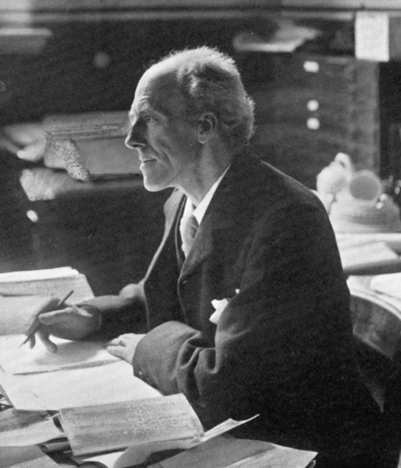
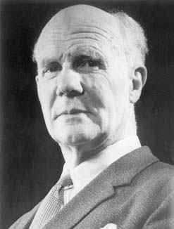
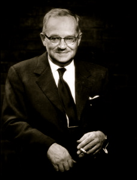
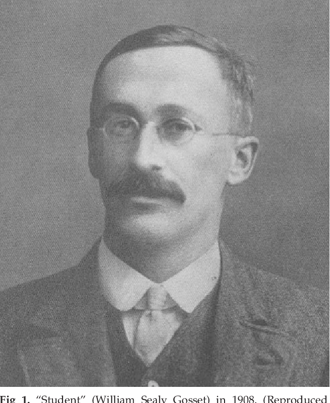

```{r setup, include=FALSE}
knitr::opts_chunk$set(echo = FALSE)
```

<script type="text/x-mathjax-config">
  MathJax.Hub.Config({
    TeX: {
      Macros: {
        arcsin: ["\\text{arcsen}", 0],
        sin: ["\\text{sen}", 0],
        N: ["\\mathbb{N}", 0],
        I: ["\\mathbb{I}", 0],
        R: ["\\mathbb{R}", 0],
        Sim: ["\\overset{\\text{iid}}{\\sim}", 0],
        Lim: ["\\displaystyle \\lim_{n\\to\\infty}", 0],
        LimInf: ["\\displaystyle \\liminf_{n\\to\\infty}", 0],
        rightLim: ["\\xrightarrow[n\\rightarrow\\infty]{}", 0],
        Sumi: ["\\displaystyle \\sum_{i=1}^{n}", 0],
        Int: ["\\displaystyle \\int_{-\\infty}^{+\\infty}", 0],
        ConvD: ["\\overset{D}{\\rightarrow}", 0],
        ConvP: ["\\overset{P}{\\rightarrow}", 0],
        Prodi: ["\\displaystyle \\prod_{i=1}^{n}", 0],
        SetaUP: ["\\underset{\\mathclap{\\substack{\\xuparrow[30pt] \\\\ #1}}}{#2}", 2],
        Home: ["\\begin{tikzpicture} \\node[scale=2] at (3,4) {\\text{Para}~\\faHome}; \\end{tikzpicture}", 0],
        vecX: ["\\boldsymbol{X}", 0],
        Implica: ["\\xRightarrow{#1}", 1],
        SeSe: ["\\iff", 0],
        EscoreA: ["\\dfrac{\\partial}{\\partial\\theta}\\log{f(x,\\theta)}", 0],
        EscoreB: ["\\dfrac{\\partial^{2}}{\\partial\\theta^{2}}\\log{f(x,\\theta)}", 0],
        cqd: ["\\text{cqd}~\\blacksquare", 0],
        seqX: ["X_{1},\\ldots,X_{n}", 0],
        seqY: ["Y_{1},\\ldots,Y_{n}", 0],
        tend: ["\\hbox{\\oalign{$\\bm{#1}$\\crcr\\hidewidth$\\scriptscriptstyle\\bm{\\sim}$\\hidewidth}}", 1],
        bx: ["\\bar{x}", 0],
        Ho: ["H_{0}", 0],
        Hi: ["H_{1}", 0],
        at: ["#1|_{#2}", 2],
        xuparrow: ["\\uparrow", 0]  // Alternativa simples
      }
    }
  });
</script>

## Sumário
- Preliminares
- Revisão Sobre Estimação Pontual

## Preliminares

### Introdução à Inferência Estatística

<p style="text-align: justify;">
A Inferência Estatística é um ramo da Estatística que se dedica a tirar conclusões sobre uma população com base em uma amostra representativa. Surgiu no início do século XX como uma resposta à necessidade de generalizar resultados de amostras, permitindo extrapolar informações de forma rigorosa e fundamentada.</p>

### Pesquisadores Relevantes

<p style="text-align: justify;">
Entre os principais pesquisadores, destacam-se:
- **Ronald Fisher**, que desenvolveu a Teoria da Estimação e o Teste de Hipóteses.
- **William Gosset (Student)**, que criou o teste t de Student.
- **Harold Hotelling**, que desenvolveu a Teoria da Distribuição Multivariada.
</p>

#### Sugestão de Leitura

Uma Senhora Toma Chá: Como a Estatística Revolucionou a Ciência no Século XX.

---

### Ronald Fisher (1890-1962)

| Ronald A. Fisher, estatístico britânico, desenvolveu a análise de variância (ANOVA) e o teste de significância. |  |
|-------------------------------------------------------------------------|-----------------------------------|

---

### Karl Pearson (1857-1936)


| Karl Pearson, estatístico britânico, é conhecido por desenvolver o conceito de correlação e regressão. |  |
|-------------------------------------------------------------------------|-----------------------------------|

---

### Egon Pearson (1895-1980)


| Egon Pearson, filho de Karl Pearson, é mais conhecido por suas contribuições à teoria dos testes de hipóteses. |  |
|-------------------------------------------------------------------------|-----------------------------------|

---

### Jerzy Neyman (1894-1981)

| Jerzy Neyman, conhecido por suas contribuições à teoria estatística, desenvolveu os intervalos de confiança. |  |
|-------------------------------------------------------------------------|-----------------------------------|

---

### William Gosset (1876-1937)

| William Sealy Gosset, que trabalhou sob o pseudônimo "Student", desenvolveu o teste t para pequenas amostras. |  |
|-------------------------------------------------------------------------|-----------------------------------|

---

### Harold Hotelling (1895-1973)

| Harold Hotelling foi um estatístico e economista americano, conhecido pelo teste de Hotelling para múltiplas variáveis. |  |
|-------------------------------------------------------------------------|-----------------------------------|

---

## Contribuições para a Estatística

<p style="text-align: justify;">
A Estatística é uma disciplina rica e diversificada, com uma longa história de contribuição de diversos pesquisadores notáveis. Além dos nomes frequentemente mencionados, muitos outros cientistas também desempenharam papéis cruciais no desenvolvimento da área. Cada um trouxe inovações e técnicas que ampliaram a capacidade da Estatística para interpretar dados e fazer previsões precisas.
</p>
<p style="text-align: justify;">
O estudo aprofundado da inferência estatística é particularmente importante, pois é a base para muitas das técnicas utilizadas na análise de dados e na tomada de decisões informadas. A inferência estatística nos permite tirar conclusões sobre uma população com base em uma amostra, calcular intervalos de confiança e realizar testes de hipóteses para validar teorias.
</p>
<p style="text-align: justify;">
Compreender esses métodos é essencial para aplicar a Estatística de maneira eficaz em diversos campos, desde a pesquisa científica até a análise de mercado e além. Portanto, um conhecimento sólido de inferência estatística é fundamental para qualquer profissional que deseje utilizar dados para gerar insights valiosos e tomar decisões fundamentadas.
</p>

## Revisão Sobre Estimação Pontual

### Definição

Em um problema estatístico típico, temos uma variável aleatória \( X \), mas sua função de densidade ou massa de probabilidade não é conhecida. A ignorância pode ser classificada em duas formas:
1. \( f(x) \) ou \( p(x) \) é completamente desconhecida.
2. A forma de \( f(x) \) ou \( p(x) \) é conhecida, mas um parâmetro \( \theta \) é desconhecido.

Vamos focar na segunda classificação.

<p style="text-align: justify;">
Alguns exemplos são os seguintes:
</p>

<ul>
<li>$X$ tem uma distribuição exponencial, $Exp(\theta)$, onde $\theta$ é desconhecido.</li>
<li>$X$ tem uma distribuição binomial $b(n, p)$, onde $n$ é conhecido, mas $p$ é desconhecido.</li>
<li>$X$ tem uma distribuição gama $\Gamma(\alpha, \beta)$, onde tanto $\alpha$ quanto $\beta$ são desconhecidos.</li>
<li>$X$ tem uma distribuição normal $N(\mu, \sigma^{2})$, onde tanto a média $\mu$ quanto a variância $\sigma^{2}$ de $X$ são desconhecidas.</li>
<li>Se a variável $X$ segue uma distribuição normal com média $\mu$ desconhecida e variância $\sigma^2$ conhecida, a média amostral $\bar{X}$ é uma estimativa pontual para $\mu$.</li>
</ul>

---

## Função de Densidade e Parâmetros

<p style="text-align: justify;">
Muitas vezes denotamos este problema dizendo que a variável aleatória $X$ tem uma função de densidade ou massa da forma $f(x; \theta)$ ou $p(x; \theta)$, onde $\theta \in \Omega$ para um conjunto especificado $\Omega$. Por exemplo, se $\Omega = \{\theta \mid \theta > 0\}$, então $\theta$ é um parâmetro positivo da distribuição. Queremos estimar $\theta$ com base em uma amostra.
</p>

<p style="text-align: justify;">
Considere uma variável $X$ com distribuição Exponencial: $f(x; \lambda) = \lambda e^{-\lambda x}$, onde $\lambda > 0$ é o parâmetro desconhecido.
</p>

---

## Observações da Amostra

<p style="text-align: justify;">
As observações da amostra têm a mesma distribuição que $X$ e as denotamos como as variáveis aleatórias $X_1, X_2, \cdots, X_{n}$, onde $n$ denota o tamanho da amostra. Quando a amostra é realmente retirada, usamos letras minúsculas $x_1, x_2, ..., x_{n}$ como os valores ou realizações da amostra. Muitas vezes, assumimos que as observações da amostra $X_1, X_2, ..., X_{n}$ também são mutuamente independentes, caso em que chamamos a amostra de amostra aleatória.
</p>

---

## Definições de Amostra e Estatística

<p style="text-align: justify;">
Se as variáveis aleatórias $X_1, X_2, \dots, X_{n}$ são independentes e identicamente distribuídas (iid), então essas variáveis constituem uma amostra aleatória de tamanho $n$ da distribuição comum.
</p>

<p style="text-align: justify;">
Seja $X_1, X_2, \dots, X_{n}$ uma amostra de uma variável aleatória $X$. Seja $T = T(X_1, X_2, \dots, X_{n})$ uma função da amostra. Então $T$ é chamado de Estatística. Uma vez que a amostra é retirada, então $t$ é chamado de realização de $T$, onde $t = T(x_1, x_2, \dots, x_{n})$ e $x_1, x_2, \dots, x_{n}$ são as realizações da amostra.
</p>

## Exemplos

<p style="text-align: justify;">
Alguns exemplos são os seguintes:
</p>

<ul>
  <li>A média amostral $\bar{X} = \frac{1}{n}\sum_{i=1}^n X_i$ é uma estatística que estima a média populacional.</li>
  <li>A variância amostral é uma função dos dados da amostra que estima a variância populacional.</li>
</ul>

---

## Estimadores Pontuais

### Estimadores Não Viesados

<p style="text-align: justify;">
Sejam $X_{1},X_{2},...,X_{n}$ uma amostra aleatória de uma variável aleatória $X$ com uma função de densidade ou massa da forma $f(x;\theta)$ ou $p(x;\theta)$, onde $\theta \in \Omega$ para um conjunto especificado $\Omega$. Nessa situação, faz sentido considerar uma estatística $T$, como um estimador de $\theta$. Mais formalmente, $T$ é chamado de estimador pontual de $\theta$. Embora chamemos $T$ de estimador de $\theta$, chamamos sua realização $t$ de estimativa de $\theta$.
</p>

<p style="text-align: justify;">
Observem que para ser um estimador pontual basta ser uma Estatística. Não fazemos nenhuma menção a qualquer correspondência entre o estimador e o parâmetro a ser estimado. No entanto, existem várias propriedades dos estimadores pontuais que discutiremos e algumas técnicas úteis que ajudam a encontrar os melhores candidatos, tais como Viés, Consistência, Eficiência, entre outras.
</p>

---

## Observações

<p style="text-align: justify;">
<ul>
  <li>Se $E(T)\neq \theta,$ dizemos que $T$ é um estimador viesado de $\theta$.</li>
  <li>Se ${\displaystyle \lim_{n\rightarrow \infty}E(T)=\theta},$ dizemos que $T$ é um estimador assintoticamente não viesado para $\theta$.</li>
</ul>
</p>

---

## Exemplos

<p style="text-align: justify;">
Considere uma amostra aleatória de uma distribuição com média $\mu$ e variância $\sigma^{2}<\infty.$
<ul>
  <li>$\bar{X}_{n}=\dfrac{\Sumi X_{i}}{n}$ é um estimador não viesado para $\mu$;</li>
  <li>Além disso, $Var\left(\bar{X}_{n}\right)=\dfrac{\sigma^{2}}{n}\overset{n\rightarrow\infty}{\rightarrow}0$;</li>
  <li>$S^{2}=\dfrac{1}{n-1}\Sumi(X_{i}-\bar{X}_{n})^{2}$ é um estimador não viesado para $\sigma^{2}$;</li>
</ul>
</p>

<p style="text-align: justify;">
Vejam alguns exemplos práticos, <a href="https://est711.shinyapps.io/EstimadoresViesados/">cliquem aqui!</a>
</p>

---

## Exemplos

<p style="text-align: justify;">
Considere $X_{i}\Sim U(0,\theta),i=1,\cdots,n.$ Seja $Y_{n}=max(X_{1},\cdots,X_{n}).$
\begin{align*}
    F_{Y_{n}}(y)&=P(Y_{n}\leq y)=P(max(X_{1},\cdots,X_{n})\leq y)\\
    &=P(X_{1}\leq y,X_{2}\leq y,\cdots, X_{n}\leq y)\\
    &=\Prodi P(X_{i}\leq y)=\left[P(X_{1}\leq y)\right]^{n}\\
    &=\left(\dfrac{y}{\theta}\right)^{n},~\text{para}~y\in (0,\theta).
\end{align*}
</p>

---

## Exemplos

<p style="text-align: justify;">
Logo, a função densidade de $Y_{n}$ é
\begin{align*}
f_{Y_{n}(y)}=\dfrac{dF_{Y_{n}}(y)}{dy}=\dfrac{ny^{n-1}}{\theta^{n}}.
\end{align*}
Segue que, 
\begin{align*}
    E(Y_{n})&=\int_{0}^{\theta}yf(y)dy=\dfrac{n}{\theta^{n}}\int_{0}^{\theta}y^{n}dy=\dfrac{n}{n+1}\theta
\end{align*}
</p>

<p style="text-align: justify;">
Logo, 
<ul>
  <li>$Y_{n}$ é um estimador viesado para $\theta;$</li>
  <li>Note que $Y_{n}$ é assintoticamente não viesado para $\theta$ e que $\dfrac{n+1}{n}Y_{n}$ é um estimador não viesado para $\theta$.</li>
</ul>
</p>

## Convergência em Probabilidade

<p style="text-align: justify;">
Dizemos que uma sequência de variáveis aleatórias $\{X_{n}\}_{n\geq 1}$ converge para uma variável aleatória $X$ se, para todo $\varepsilon > 0,$
</p>

$$
\lim_{n\to\infty}P(|X_{n} - X| \geq \varepsilon) = 0,
$$

<p style="text-align: justify;">
ou equivalentemente,
</p>

$$
\lim_{n\to\infty}P(|X_{n} - X| < \varepsilon) = 1.
$$

<p style="text-align: justify;">
Se isso ocorrer, escrevemos $X_{n} \xrightarrow{P} X$. 
</p>

<p style="text-align: justify;">
Em muitas situações, $X$ é uma v.a. degenerada, ou seja, $X$ é igual a uma constante com probabilidade $1.$ Vejam alguns exemplos, <a href="https://est711.shinyapps.io/ConvergenciaProbabilidade/">Clique aqui!</a>.
</p>

## Desigualdades de Markov e Tchebychev

<p style="text-align: justify;">
A Desigualdade de Markov afirma que, para uma variável aleatória não negativa $Y$ e um valor positivo $a$, temos:
</p>

$$
P(Y \geq a) \leq \frac{\mathbb{E}[Y]}{a}.
$$

<p style="text-align: justify;">
Seja $X$ uma v.a. com média $\mu$ e variância $\sigma^{2}.$ Então,
</p>

$$
P(|X-\mu|\geq t)\leq \dfrac{Var(X)}{t^{2}}=\dfrac{\sigma^{2}}{t^{2}},~t>0
$$

<p style="text-align: justify;">
\textbf{Obs:} O nome correto é Tchebychev no contexto de português, enquanto Chebyshev é a forma utilizada em inglês. Ambos se referem ao mesmo matemático russo, Pafnuty Chebyshev.
</p>

## Lei Fraca dos Grandes Números

<p style="text-align: justify;">
Seja $\{X_{n}\}_{n\geq 1}$ uma sequência de v.a. i.i.d, com média $\mu$ e variância $\sigma^{2}<\infty.$ Então,
</p>

$$
\bar{X}_{n}=\dfrac{\sum_{i=1}^{n} X_{i}}{n}\xrightarrow{P} \mu
$$

<p style="text-align: justify;">
Vejam alguns exemplos práticos, <a href="https://est711.shinyapps.io/ConvergenciaProbabilidade/">Clique aqui!</a>.
</p>

<p style="text-align: justify;">
Seja $\varepsilon>0.$ Temos que,
</p>

$$
P(|\bar{X}_{n}-\mu|\geq \varepsilon)=P(|\bar{X}_{n}-\mu|\geq \varepsilon) \underset{\mathclap{\substack{\xuparrow \\ \text{Tchebychev}}}}{\leq}\dfrac{1}{\varepsilon^{2}} \dfrac{\sigma^{2}}{n} \xrightarrow[n\rightarrow\infty]{} 0
$$

## Propriedade da Convergência em Probabilidade

<p style="text-align: justify;">
Suponha que $X_{n}\xrightarrow{P} X$ e $Y_{n}\xrightarrow{P} Y.$ Então, $X_{n}+Y_{n}\xrightarrow{P} X+Y.$
</p>

<p style="text-align: justify;">
\begin{tikzpicture}
\node[scale=2] at (3,4) {\text{Para}~\faHome};
\end{tikzpicture}
</p>


## Propriedades de Convergência em Probabilidades

### Teorema
<p style="text-align: justify;">Suponha que \( X_{n} \) converge em probabilidade para \( X \) e \( a \) é uma constante. Então, \( aX_{n} \) converge em probabilidade para \( aX \).</p>

### Demonstração
<p style="text-align: justify;">Se \( a = 0 \), o resultado é imediato. Suponha \( a \neq 0 \). Seja \( \varepsilon > 0 \). O resultado segue das seguintes igualdades:</p>


$P[|aX_{n} - aX| \geq \varepsilon] = P[|a||X_{n} - X| \geq \varepsilon] = P[|X_{n} - X| \geq \varepsilon/|a|]$


<p style="text-align: justify;">E pelas hipóteses, o último termo converge para \( 0 \) conforme \( n \to \infty \).</p>

---

### Teorema
<p style="text-align: justify;">Suponha que \( X_{n} \) converge em probabilidade para \( a \) e a função real \( g \) é contínua em \( a \). Então, \( g(X_{n}) \) converge em probabilidade para \( g(a) \).</p>

### Demonstração
<p style="text-align: justify;">Seja \( \varepsilon > 0 \). Como \( g \) é contínua em \( a \), existe \( \delta > 0 \) tal que se \( |x - a| < \delta \), então \( |g(x) - g(a)| < \varepsilon \). Assim,</p>


$|g(x) - g(a)| \geq \varepsilon \Rightarrow |x - a| \geq \delta$


<p style="text-align: justify;">Substituindo \( X_{n} \) por \( x \) na implicação acima, obtemos</p>


$P[|g(X_{n}) - g(a)| \geq \varepsilon] \leq P[|X_{n} - a| \geq \delta]$


<p style="text-align: justify;">Pelas hipóteses, o último termo converge para \( 0 \) conforme \( n \to \infty \), o que nos dá o resultado.</p>

---

### Propriedades Adicionais

<p style="text-align: justify;">Este teorema nos fornece muitos resultados úteis. Por exemplo, se \( X_{n} \) converge em probabilidade para \( a \), então:</p>
<ul>
  <li><p style="text-align: justify;">\( X^{2}_{n} \) converge em probabilidade para \( a^{2} \).</p></li>
  <li><p style="text-align: justify;">\( \frac{1}{X_{n}} \) converge em probabilidade para \( \frac{1}{a} \), desde que \( a \neq 0 \).</p></li>
  <li><p style="text-align: justify;">\( X_{n} \) converge em probabilidade para \( \sqrt{a} \), desde que \( a \geq 0 \).</p></li>
</ul>

---

### Teorema
<p style="text-align: justify;">Se \( X_{n} \) converge em probabilidade para \( X \) e \( g \) é uma função contínua, então \( g(X_{n}) \) converge em probabilidade para \( g(X) \).</p>

### Demonstração
<p style="text-align: justify;">Página 104 de Tucker (1967).</p>

---

### Teorema
<p style="text-align: justify;">Suponha que \( X_{n} \) converge em probabilidade para \( X \) e \( Y_{n} \) converge em probabilidade para \( Y \). Então, \( X_{n}Y_{n} \) converge em probabilidade para \( XY \).</p>

### Demonstração
<p style="text-align: justify;">Utilizando os resultados anteriores, temos:</p>


\begin{align*}
X_{n}Y_{n} &= \frac{1}{2}X^{2}_{n} + \frac{1}{2}Y^{2}_{n} - \frac{1}{2}(X_{n} - Y_{n})^{2} \xrightarrow{P} \frac{1}{2}X^2 + \frac{1}{2}Y^2 - \frac{1}{2}(X - Y)^{2}\\
&= XY
\end{align*}


---

## Consistência

### Definição
<p style="text-align: justify;">Seja \( X \) uma variável aleatória com função de distribuição acumulada \( F(x, \theta) \), \( \theta \in \mathcal{A}\subseteq \Omega \). Seja \( X_1, \ldots, X_{n} \) uma amostra da distribuição de \( X \) e seja \( T_{n} \) uma estatística \( (T_{n}=T(X_1, \ldots, X_{n})) \). Dizemos que \( T_{n} \) é um estimador consistente para \( \theta \) se \( T_{n} \xrightarrow{P} \theta \).</p>

---

### Exemplo

<p style="text-align: justify;">Sejam \( X_{1}, \ldots, X_{n}, \ldots \) uma sequência de variáveis aleatórias iid de uma distribuição com média finita \( \mu \) e variância \( \sigma^{2}<+\infty \), então, pela Lei Fraca dos Grandes Números, temos que, \( \bar{X}_{n}=\dfrac{\Sumi X_{i}}{n} \ConvP \mu \). Ou seja, \( \bar{X}_{n} \) é um estimador consistente de \( \mu \).</p>

---

### Exemplo

<p style="text-align: justify;">Sejam \( X_1, \ldots, X_{n} \) uma amostra aleatória de uma distribuição com média \( \mu \) e variância \( \sigma^{2}<+\infty \). Suponha que \( E[X^{4}_{1}] < +\infty \), de tal forma que \( Var(S^{2}) < +\infty \).</p>


\begin{align*}
S^2_{n} &= \frac{1}{n-1} \sum_{i=1}^n (X_i - \overline{X}_{n})^2\\
&= \frac{1}{n-1} \left(\sum_{i=1}^n X_{i}^{2} - n\overline{X}_{n}^{2}\right)\\ 
&= \frac{n}{n-1} \left(\frac{1}{n}\sum_{i=1}^n X^2_i - \overline{X}^{2}_{n}\right) \xrightarrow{P} 1 \cdot [E(X^2_1) - \mu^2] = \sigma^2
\end{align*}


---

<p style="text-align: justify;">Portanto, a variância da amostra é um estimador consistente de \( \sigma^2 \). A partir da discussão acima, temos imediatamente que \( S_{n} \xrightarrow{P} \sigma \); ou seja, o desvio padrão da amostra é um estimador consistente do desvio padrão populacional. Vejam estes exemplos anteriores na prática, <a href="https://est711.shinyapps.io/ConvergenciaProbabilidade/">Clique aqui!</a>.</p>

---

### Exemplo

<p style="text-align: justify;">Considere \( X_{i} \overset{\text{iid}}{\sim} U(0,\theta),~i=1,2,\ldots,n \), e \( Y_{n} = \max\{X_{1}, \ldots, X_{n}\} \). Seja \( \varepsilon > 0 \), segue que:</p>


$P(|Y_{n}-\theta|\geq \varepsilon) = P(\theta - Y_{n} \geq \varepsilon) = P(Y_{n} \leq \theta - \varepsilon)$


---

<p style="text-align: justify;">Se \( \theta - \varepsilon \leq 0 \), então \( P(Y_{n} \leq \theta - \varepsilon) = 0 \), pois \( 0 \leq Y_{n} \leq \theta \), com \( P(0 \leq Y_{n} \leq \theta) = 1 \).</p>


<p style="text-align: justify;">Se \( 0 < \varepsilon < \theta \) então:</p>


$P(|Y_{n} - \theta| \geq \varepsilon) = P(Y_{n} \leq \theta - \varepsilon) = F_{Y_{n}}(\theta - \varepsilon) = \left(1 - \frac{\theta - \varepsilon}{\theta}\right)^n = \left(\frac{\varepsilon}{\theta}\right)^n \to 0 \text{ à medida que } n \to \infty$


<p style="text-align: justify;">Portanto, o máximo \( Y_{n} \) é um estimador consistente para \( \theta \).</p>

---

## Distribuições Limites

### Definição
<p style="text-align: justify;">A distribuição limite é uma distribuição de probabilidade que descreve o comportamento assintótico de uma sequência de variáveis aleatórias conforme o tamanho da amostra cresce para infinito. As distribuições limites mais comuns incluem a Normal, Poisson e Exponencial.</p>

---

### Lei dos Grandes Números

<p style="text-align: justify;">A Lei dos Grandes Números afirma que a média amostral de uma sequência de variáveis aleatórias independentes e identicamente distribuídas converge em probabilidade para a média populacional conforme o tamanho da amostra tende ao infinito. Ou seja, para uma sequência de variáveis aleatórias \( X_1, X_2, \ldots \) com média \( \mu \) e variância \( \sigma^2 \), a média amostral \( \bar{X}_n \) converge para \( \mu \) conforme \( n \to \infty \).</p>

---

### Teorema Central do Limite

<p style="text-align: justify;">O Teorema Central do Limite afirma que, sob certas condições, a soma de variáveis aleatórias independentes e identicamente distribuídas tende a uma distribuição normal conforme o tamanho da amostra aumenta. Especificamente, se \( X_1, X_2, \ldots, X_n \) são variáveis aleatórias independentes com média \( \mu \) e variância \( \sigma^2 \), então</p>


\frac{\overline{X}_n - \mu}{\sigma / \sqrt{n}} \xrightarrow{D} \mathcal{N}(0, 1)


<p style="text-align: justify;">ou seja, a distribuição da média amostral normaliza e converge para a distribuição normal padrão.</p>

---

## Exemplo 2 (Convergência em Distribuição não Implica Convergência em Probabilidade)

<p style="text-align: justify;">Seja \(X\) uma variável aleatória contínua simétrica em torno do zero (ou seja, se \(f\) denota sua densidade, então \(f(x) = f(-x), \forall x\in \R\). Neste caso, \(X\) e \(-X\) têm a mesma distribuição (Verifiquem!). Defina a sequência de variáveis aleatórias \(X_{n}\) como:</p>
<p style="text-align: justify;">\(X_{n} = \begin{cases} 
X, & \text{se } n \text{ é par} \\ 
-X, & \text{se } n \text{ é ímpar} 
\end{cases}\)</p>

---

<p style="text-align: justify;">É fácil ver que \(F_{X_{n}}(x) = F_{X}(x)\). Logo, \(X_{n} \overset{D}{\rightarrow} X\). Porém, \(X_{n} \overset{P}{\cancel{\rightarrow}} X\), pois:</p>
<p style="text-align: justify;">\(P(|X_{n}-X| \geq \varepsilon) = \begin{cases} 
0, & \text{se } n \text{ é par} \\ 
P(2|X| \geq \varepsilon), & \text{se } n \text{ é ímpar}
\end{cases}\)</p>

---

## Exemplo 3

<p style="text-align: justify;">Seja \(T_{n}\) uma variável aleatória com distribuição t-Student com \(n\) graus de liberdade, ou seja, a densidade de \(T_{n}\) é dada por:</p>
<p style="text-align: justify;">
\[
f_{T_{n}}(y) = \dfrac{\Gamma\Big(\dfrac{n+1}{2}\Big)}{\sqrt{n\pi}\Gamma\Big(\dfrac{n}{2}\Big)} \dfrac{1}{\Big(1+\dfrac{y^{2}}{n}\Big)^{\frac{n+1}{2}}}, \quad y \in \R
\]
</p>

---

<p style="text-align: justify;">Temos que:</p>
<p style="text-align: justify;">
\[
\lim_{n\rightarrow+\infty}F_{T_{n}}(t) = \lim_{n\rightarrow+\infty}\int_{-\infty}^{t}\dfrac{\Gamma\Big(\dfrac{n+1}{2}\Big)}{\sqrt{n\pi}\Gamma\Big(\dfrac{n}{2}\Big)} \dfrac{1}{\Big(1+\dfrac{y^{2}}{n}\Big)^{\frac{n+1}{2}}}dy
\]
</p>

---

<p style="text-align: justify;">Considere a seguinte aproximação de Stirling (Conhecida como fórmula de Stirling):</p>
<p style="text-align: justify;">
\[
\Gamma(t+1) \approx \sqrt{2\pi t}\Big(\dfrac{t}{e}\Big)^{t}
\]
Ou seja, 
\[
\lim_{t\rightarrow+\infty} \dfrac{\Gamma(t+1)}{\sqrt{2t\pi}\Big(\dfrac{t}{e}\Big)^{t}} = 1
\]
</p>

---

<p style="text-align: justify;">Logo:</p>
<p style="text-align: justify;">
\[
\lim_{n\rightarrow+\infty}\dfrac{\Gamma\Big(\dfrac{n+1}{2}\Big)}{\sqrt{n\pi}\Gamma\Big(\dfrac{n}{2}\Big)} \dfrac{1}{\Big(1+\dfrac{y^{2}}{n}\Big)^{\frac{n+1}{2}}}
\]
\begin{scriptsize}
\[
= \lim_{n\rightarrow+\infty}
\dfrac{\sqrt{2\pi}\Big(\frac{n-1}{2}\Big)^{\frac{n-1}{2}+\frac{1}{2}}e^{-(\frac{n-1}{2})}}{\sqrt{n}\sqrt{2\pi}\Big(\dfrac{n-2}{2}\Big)^{\frac{n-2}{2}+\frac{1}{2}}e^{-(\frac{n-2}{2})}}\dfrac{1}{\Big(1+\dfrac{y^{2}}{n}\Big)^{\frac{n+1}{2}}}
= \star \quad (\text{t da fórmula de Stirling será}~\frac{n-1}{2})
\]
</p>

---

<p style="text-align: justify;">Portanto, substituindo em \(\star\star\), temos:</p>
<p style="text-align: justify;">
\[
\lim_{n\rightarrow+\infty}F_{T_{n}}(t) = \int_{-\infty}^{t}\dfrac{e^{-\frac{y^{2}}{2}}}{\sqrt{2\pi}}dy
\]
Logo, \(T_{n} \overset{D}{\rightarrow} N(0,1)\).
</p>

---

## Teorema

<p style="text-align: justify;">Se \(X_{n} \overset{P}{\rightarrow} X\), então \(X_{n} \overset{D}{\rightarrow} X\).</p>

---

## Teorema

<p style="text-align: justify;">Se \(X_{n} \overset{D}{\rightarrow} a\), então \(X_{n} \overset{P}{\rightarrow} a\), onde \(a\) é uma constante.</p>

---

## Teorema

<p style="text-align: justify;">Se \(X_{n} \overset{D}{\rightarrow} X\) e \(Y_{n} \overset{P}{\rightarrow} 0\), então \(X_{n}+Y_{n} \overset{D}{\rightarrow} X\).</p>

---

## Teorema

<p style="text-align: justify;">Se \(X_{n} \overset{D}{\rightarrow} X\) e \(g\) é uma função contínua no suporte de \(X\), então:</p>
<p style="text-align: justify;">
\[
g(X_{n}) \overset{D}{\rightarrow} g(X)
\]
</p>

---

## Teorema de Slutsky

<p style="text-align: justify;">Sejam \(X_{n}\), \(A_{n}\) e \(B_{n}\) variáveis aleatórias com \(X_{n} \overset{D}{\rightarrow} X\), \(A_{n} \overset{P}{\rightarrow} a\) e \(B_{n} \overset{P}{\rightarrow} b\), onde \(a\) e \(b\) são constantes reais. Então:</p>
<p style="text-align: justify;">
\[
A_{n}X_{n} + B_{n} \overset{D}{\rightarrow} aX + b
\]
</p>

---

## Exercícios

<p style="text-align: justify;">Exercícios 5.2.2, 5.2.3, 5.2.6, 5.2.12, 5.2.15, 5.2.17, 5.2.19 e 5.2.20</p>

---

## Referências

<p style="text-align: justify;">
\printbibliography
</p>


